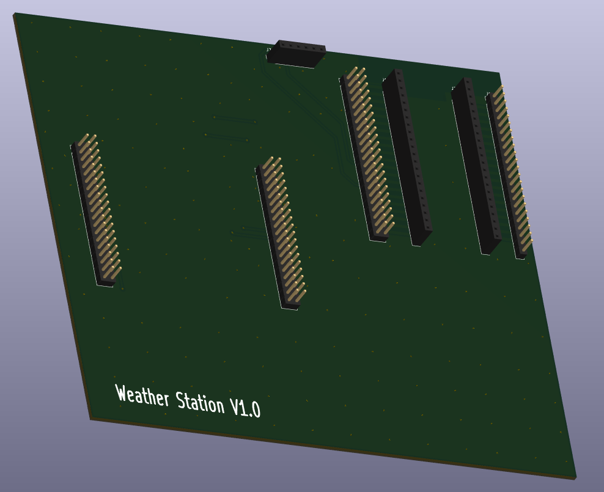
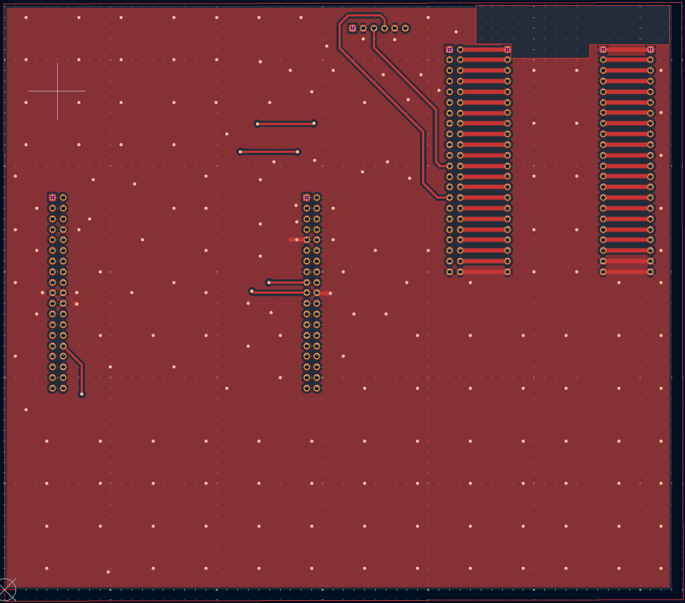
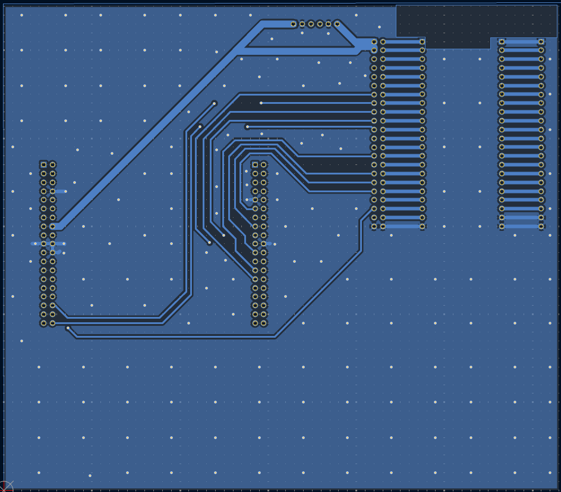

## Weather Station PCB
I will be making a simple PCB in KICAD which can hold the ESP32, display and Bosch weather sensor in pin holder rows for easy mounting and reuse of components 

STATUS 08-05-2026
PCB done and order sent to JLCPCB. Status there right now is that production is complete, so only shipping remains.

